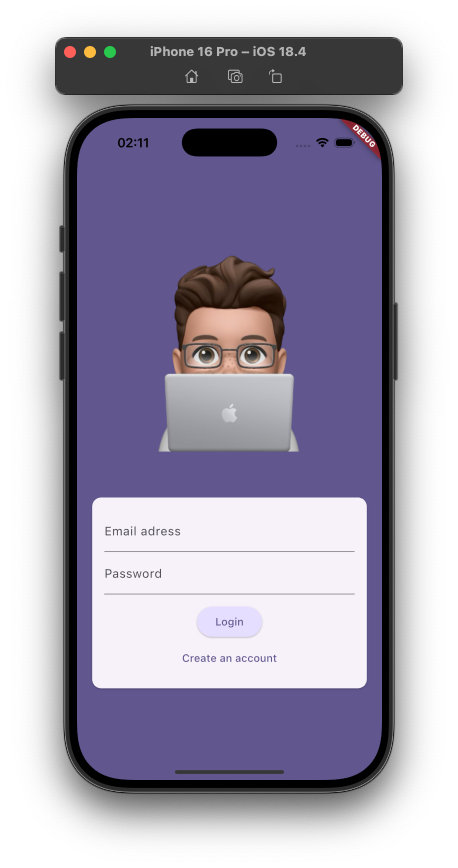
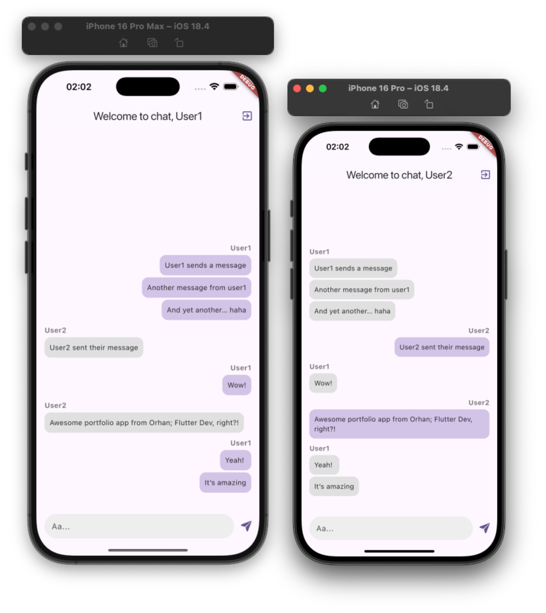

# 💬 Flutter Chat App

A simple real-time chat application built with **Flutter** and **Firebase**.

## 🔧 Features

- User authentication using **Firebase Authentication**
- Real-time messaging with **Cloud Firestore**
- Integrated via official **Firebase SDK** for all backend services
- Adaptive UI for Android and iOS (SafeArea, Cupertino icons)
- Clean and minimal chat interface

## 🛠️ Technologies

- Flutter (Dart)
- Firebase Auth
- Cloud Firestore
- Firebase Core SDK

## 🖼️ Screenshots
### Login Screen 

### Chat screen

## 📘 About this project

This project represents a final practice app, where I applied fundamental techniques in **Flutter development** — including UI building, Firebase integration, and cross-platform responsiveness.

After working extensively with **iOS (Swift, SwiftUI)**,  
this app marks a practical step in expanding my skillset into the Flutter ecosystem.

Feel free to share feedback or suggestions!

